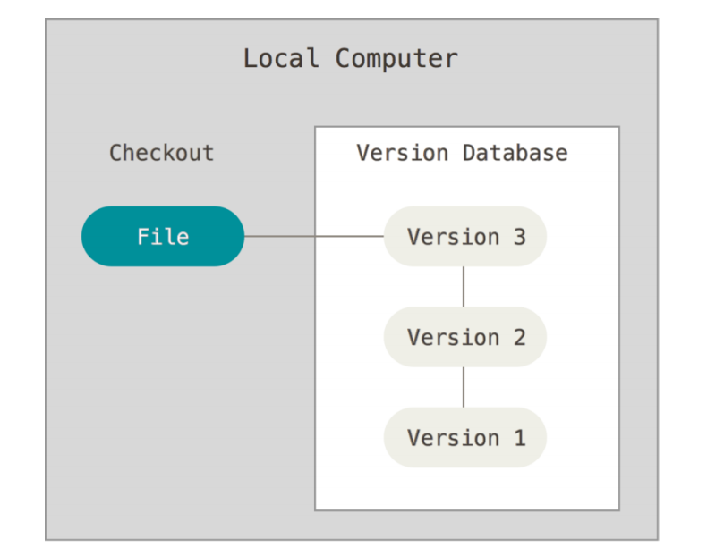
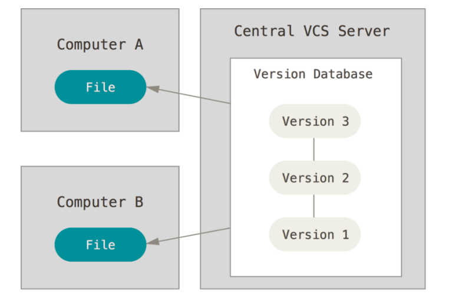
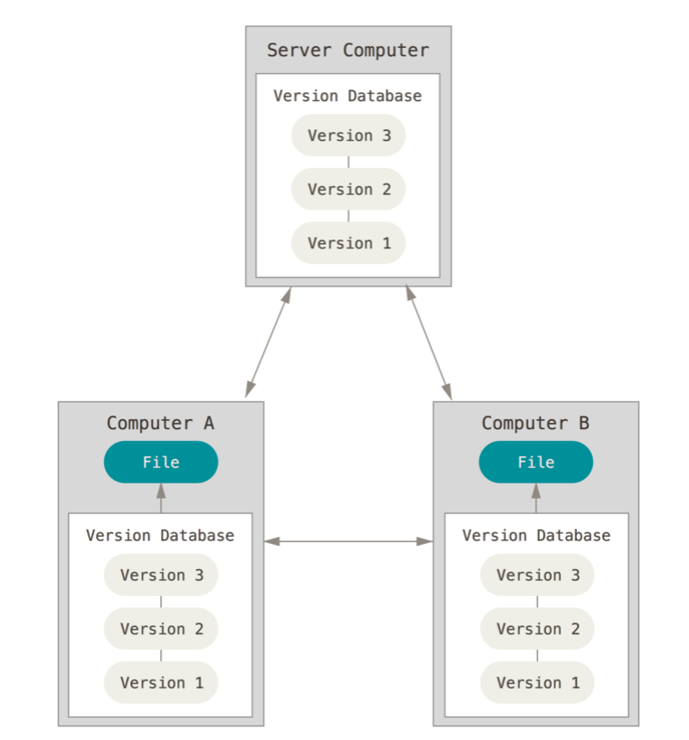
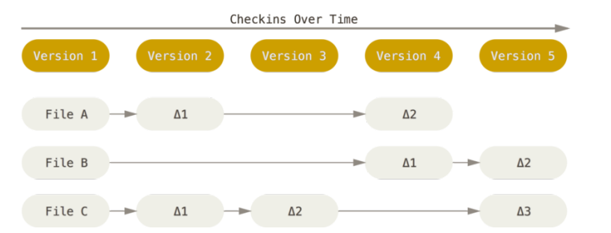
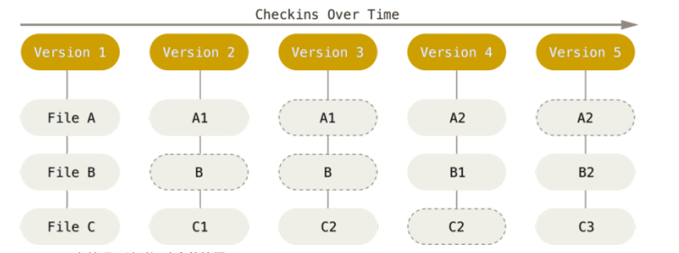

# 精通Git

## 起步

### 版本控制
版本控制`VCS`是一套系统，该系统按时间顺序记录某一个或一系列文件的变更，让我们可以查看其以前的特定版本，其有三种类别：**本地版本控制系统**、**集中式版本控制系统**、**分布式版本控制系统**。

#### 本地版本控制系统
很多人控制版本的方式是将文件复制到另一个文件目录，甚至还会给目录加上一个时间戳，这种做法很常见，而且很容易实现。但这种方式也同样出错，随后衍生出来的`RCS`工具，它是一种常见的`VCS`工具，它会在磁盘上以一种特殊的格式保存补丁集。



#### 集中式版本控制系统
由于本地版本控制系统无法解决多人协作问题，集中式版本控制系统`CVCS`也就应运而生了。它与本地版本控制系统相比，有多方面的优势：
* 所有人在一定程度上知道其他人在项目里做了什么。
* 管理员可以精细的控制每一个人的权限。
* 维护一个集中式版本控制系统要比在每台客户机上都维护一个数据库简单得多。

但集中式版本控制系统也不是没有缺点的，它最大的缺点是故障问题：如果集中式服务器存在故障宕机，那么这期间任何人都不能协作或者提交更改；如果中央数据库所在的硬盘受损，备份也没有保住的情况下，代码将会面临全面丢失的风险。



#### 分布式版本控制系统
为了针对解决以上集中式版本控制系统所存在的潜在问题，进而出现了分布式版本控制系统`DVCS`。对于一个分布式版本控制系统来说，客户端冰粉仅仅是检出文件的最新快照，而是对代码仓库进行完整的镜像。这样一来，无论哪一个服务器出现故障，任何一个客户端都可以使用自己本地的镜像来恢复服务器。



除了以上提到的有点，分布式版本控制系统可以很好的处理多个远程仓库。

### 简史
同许多伟大的事物一样，`Git`的诞生伴随着许多颠覆式的创新以及激烈的争论。

* 2002年，`Linux`内核项目开始采用一款叫做`BitKeeper`的专用分布式版本控制系统。
* 2005年，`Linux`开发者社区与`BitKeeper`研发公司关系破裂，该公司回收了软件的免费使用权，这个事情促使了`Linux`开发社区决定开发自己的版本控制系统。
* 2005年，`Git`版本控制系统诞生。

`Git`开发之初，它的设计目标如下：
* 速度快
* 设计简洁
* 对于非线性开发强有力的支持
* 完全的分布式设计
* 能够有效的处理大象项目

### Git基础

#### 快照，而非差异
`Git`与其他版本控制系统相比，最大的不同在于其对待数据的方式。
* 其他版本控制系统：将其存储的信息视为一组文件以及对这些文件随时间所作出的变更。



* `Git`版本控制系统：每次提交或在`Git`中保存项目的状态时，`Git`会抓取一张所有文件当前状态的快照，然后存储一个指向该快照的引用。


#### Git的完整性
`Git`的所有数据在存储前都会执行校验和计算，随后以校验和来引用对应的数据，其采用的校验和机制叫做`SHA-1`散列，它是一个由`40`个十六进制字符所组成的字符串，它是根据文件内容或`Git`的目录结构计算所得到的。一个`SHA-1`散列的案例如下：
```sh
24b9da6552252987aa493b52f8696cd6d3b00373
```

#### 三种状态
在`Git`中，文件可以处于以下三种状态之一：
* 已修改`modified`：已修改表示已经改动了文件，但尚未提交到数据库。
* 已暂存`staged`：已暂存表示对已修改文件的当前版本做出了标识并将其加入到下一次提交的快照中。
* 已提交`committed`：已提交表示数据已经被安全地存入本地数据库中。

根据以上文件的三种状态，由此便引入了`Git`的三个主要区域的概念：
* 工作目录：是项目某个版本的单次检出
* 暂存区：是一个文件，一般位于`Git`目录中，它保存了下一次所要提交内容的相关信息。
* `Git目录`：是保存项目元数据和对象数据库的地方，它是`Git`最核心最重要的部分。

根据以上的概念，我们不难推测出`Git`的基本工作流：
* 修改工作目录中的文件。
* 暂存文件，将这些文件的快照加入暂存区。
* 提交暂存区中的文件，将快照永久的保存在`Git`目录中。


## Git基础
在安装完毕`Git`后，我们首先需要做的就是配置`Git`信息配置：
::: tip 参数说明
`--global`参数代表在当前计算机中全局配置，如果不带此参数，则代表仅在当前的`Git`目录下配置用户名和邮箱地址。
:::
```sh
$ git config --global user.name 'your name'
$ git config --global user.email 'you email'
```
注意：配置用户名和电子邮件地址非常重要，因为`Git`的每一次提交都会用到这些信息，而且还会被写入到所创建的提交中，不可更改。

在配置完用户名和邮箱地址后，我们可以使用如下命令查看我们的相关配置信息：
```sh
# 列举所有配置
$ git config --list
user.email=your email
user.name=your name

# 查看单个配置后
$ git config user.name
your name
```
### 获取Git仓库

### 记录更改到仓库

### 查看提交历史

### 撤销操作

### 远程仓库

### 打标签

### Git别名


## Git分支

### 分支简史

### 新建、合并分支

### 分支管理

### 分支开发工作流

### 远程分支

### 变基


## 服务器上的Git

### 协议

### 在服务器上搭建Git

### 生成SSH公钥

### 配置服务器

### Git守护进程

### Smart HTTP

### GitWeb

### GitLab


## 分布式Git

### 分布式工作流程

### 对项目做出贡献

### 维护项目


## Git工具

### 选择修订版本

### 交互式暂存

### 存储与清理

### 签署工作

### 搜索

### 重写历史

### 重置揭秘

### 高级合并

### Refere

### 使用Git调试

### 子模块

### 打包

### 替换

### 凭证存储


## 自定义Git

### 配置Git

### Git属性

### Git钩子

### 使用强制策略


## Git内部原理

### 底层命令和高层命令

### Git对象

### Git引用

### 包文件

### 引用规格

### 传输协议

### 维护与数据恢复

### 环境变量