# Vue

## Vue 基础知识

### MVVM 模式

`MVVM`是`Model-View-ViewModel`的缩写，其核心是提供对`View`和`ViewModel`的双向数据绑定。既`ViewModel`的状态改变可以自动传递给`View`，也就是所谓的数据双向绑定。

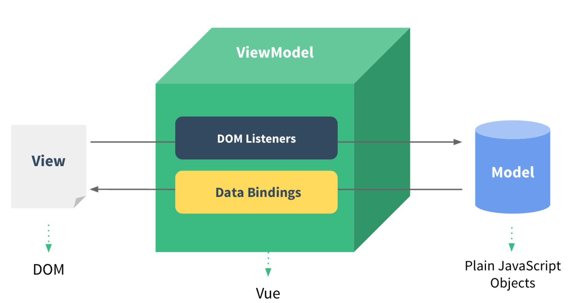

**View 层：**

```html
<div id="app">
  <input type="text" v-model="inputValue" />
  <button @click="handleSubmitClick">提交</button>
  <ul>
    <li v-for="(item,index) of list" :key="index">{{item}}</li>
  </ul>
</div>
```

**Model 层：**

```js
<script src="./vue.js"></script>
<script>
  // Model(数据)  View(页面)  VM(vue.js)
  var app = new Vue({
    el: '#app',
    data() {
      return {
        list: [],
        inputValue: ''
      }
    },
    methods: {
      handleSubmitClick() {
        this.list.push(this.inputValue)
        this.inputValue = ''
      }
    }
  })
</script>
```

### 安装

`Vue.js`安装方式有很多种，它也有很多的版本，例如：

- 可以通过`script`标签引入
- 可以通过`npm`引入
- 可以通过其他方式引入
  为了学习的方便，我们通常使用`script`标签来引入`vue.js`开发版本。

### Vue 实例

每一个`Vue`应用都会通过`new Vue()`的方式构造一个`Vue`实例，一个大型的`Vue`项目，往往由一个`Vue`根实例和一些可选组件实例所构成。

```js
根实例
└─ TodoList
   ├─ TodoItem
   │  ├─ DeleteTodoButton
   │  └─ EditTodoButton
   └─ TodoListFooter
      ├─ ClearTodosButton
      └─ TodoListStatistics
```

**实例属性和方法：**
`Vue`实例在被创建的时候，只有在`data`中声明的变量才会是响应式的，实例在被创建之后，实例上会有一些实例属性和方法，当然用户在`data`中定义的变量也被挂载到了`Vue`实例上。

```js
// vue实例
var app = new Vue({
  el: "#app",
  data() {
    return {
      message: "hello,world",
      age: 23,
      name: "AAA"
    }
  }
})

// 实例属性和方法
console.log(app.$data)
console.log(app.$data.age)
console.log(app.$el)

// 只有在data中声明的属性才是响应式的
app.address = "广州" // 这个属性不是响应式的
app.age = 32 // 这个属性是响应式的
```

### Vue 生命周期

::: tip 理解
`Vue`实例的生命周期就是：`Vue`实例在某一个时间点会自动执行的函数。Vue 生命周期有 11 种之多，它分为不同的组。

- `beforeCreate`和`created`这两个钩子函数，会在`Vue`实例被创建之前和创建后分别调用
- `beforeMount`和`mounted`这两个钩子函数，会在模板和数据相结合被挂载到页面之前和之后分别调用
- `beforeUpdate`和`updated`这两个钩子函数，会在数据发生变化之前和之后分别调用
- `beforeDestory`和`destory`这两个钩子函数，会在`Vue`实例被销毁之前和销毁之后分别调用
- `activated`和`deactivated`这两个钩子函数，会在`keep-alive`组件激活和停用时分别调用
- `errorCaptured`会在捕获子组件、孙组件发生错误时触发(2.5.0+版本新增)
  :::


**生命周期的使用：**

```js
var app = new Vue({
  el: "#app",
  data() {
    return {
      message: "hello,world",
    }
  },
  beforeCreate() {
    console.log("beforeCreate")
  },
  created() {
    console.log("created")
  },
  beforeMount() {
    console.log("beforeMount")
  },
  mounted() {
    console.log("mounted")
  },
  beforeUpdate() {
    console.log("beforeUpdate")
  },
  updated() {
    console.log("updated")
  },
  beforeDestory() {
    console.log("beforeDestory")
  },
  destoryed() {
    console.log("destoryed")
  }
})
```

### Vue 模板语法

#### 插值

`Vue`的模板语法常见绑定值的方式有很多种，常见的三种它们各自的特点如下：

- 使用`Mustache`来实现插值，即可以只是一个变量，也可以是一个`js`表达式
- 使用`v-text`指令来实现插值，它的作用同`Mustache`类似，同样也可以是一个`js`表达式
- 使用`v-html`指令也能实现插值，它的作用是将原始的插值进行原始`html`解析

```html
<p>{{message}}</p>
<p v-text="message"></p>
<p v-html="message"></p>

<p v-text="rawHTML"></p>
<p v-html="rawHTML"></p>
```

```js
var app = new Vue({
  el: "#app",
  data() {
    return {
      message: "hello,world",
      rawHTML: "<h1>hello,world</h1>"
    }
  }
})
```


#### 指令

`Mustache`语法不能作用于某些`html`特性上，这个时候，指令就派上了用处，常见的指令有:

- `v-bind`：它的作用是绑定一个`html`标签特性，例如：`<button v-bind:id='btn'></button>`
- `v-on`: 它的作用是绑定一个`html`标签的事件，例如：`<button v-on:click='handleBtnClick'></button>`
- `v-if`：它的作用是根据某个变量的`boolean`值，进行控制此元素是否在`html`文档上出现
- `v-show`：它的作用同`v-if`类似，不过两者之间最本质的差别是，`v-show`是通过`css`属性`display:none`来控制元素是否显示。
- 其他自定义指令

```html
<!-- v-bind -->
<button v-bind:id="submitBtn">按钮</button>

<!-- v-on -->
<button v-on="handleBtnClick">按钮</button>

<!-- v-if -->
<p v-if="isShow">v-if元素标签</p>

<!-- v-show -->
<p v-show="isShow">v-show元素标签</p>
```

```js
var app = new Vue({
  el: "#app",
  data() {
    return {
      isShow: false
    }
  },
  methods: {
    handleBtnClick() {
      console.log("v-on click")
    }
  }
})
```

**运行结果：**

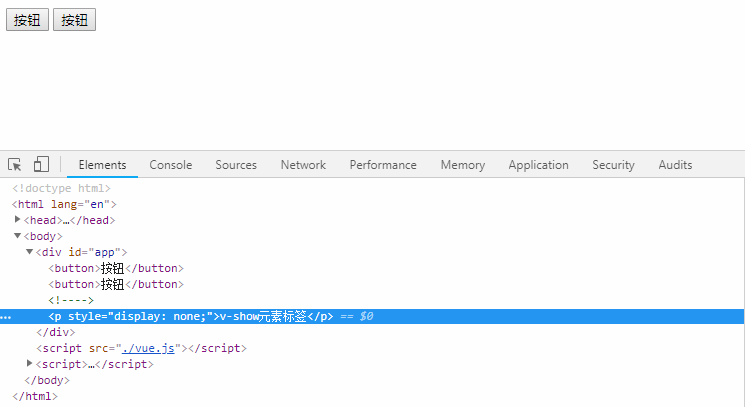

#### 缩写

::: tip

- `v-bind`的缩写形式是`:bind`
- `v-on`的缩写形式是`@on`
  :::

```html
<!-- v-bind的缩写 -->
<button v-bind:id="submitBtn"></button>
<button :id="submitBtn"></button>

<!-- v-on的缩写 -->
<button v-on="handleBtnClick"></button>
<button @click="handleBtnClick"></button>
```

### 计算属性、方法和监听器

#### 计算属性

::: tip
在`Mustache`语法中，它允许我们书写一些`js`逻辑在里面，对于一些简单的逻辑，书写在`Mustache`语法中是非常合适的，但对于复杂的逻辑，就十分不合适了，这个就是计算属性能帮到我们。**计算属性是基于它的依赖进行缓存的**，意思是只要你依赖的变量的值不发生变化，计算属性永远只会计算这一次。
:::

```html
<div id="app">
  <!-- 输出：Hello，world -->
  {{fullName}}
</div>
```

```js
<script src="./vue.js"></script>
<script>
  var app = new Vue({
    el: '#app',
    data() {
      return {
        firstName: 'Hello，',
        lastName: 'world'
      }
    },
    computed: {
      fullName() {
        return this.firstName + this.lastName
      }
    }
  })
</script>
```

#### 计算属性 vs 方法

::: tip
一些计算属性能够做到的事情，使用方法同样能够做到，但就像上面所讲到的那样：**计算属性是基于它的依赖而进行缓存的**，相反使用方法的话，它会每次都计算一次，对于一些开销较大的逻辑，我们更推荐使用计算属性而不是方法。
:::

```html
<div id="app">
  计算属性：{{reverseMsg}}<br />
  方法：{{reverseMsgMethods()}}
</div>
```

```js
var app = new Vue({
  el: "#app",
  data() {
    return {
      msg: "hello,world"
    }
  },
  computed: {
    reverseMsg() {
      return this.msg.split("").reverse().join("")
    }
  },
  methods: {
    reverseMsgMethods() {
      return this.msg.split("").reverse().join("")
    }
  }
})
```

**运行结果：**


#### 计算属性 vs 监听属性

::: tip
监听属性`watch`作用是当监听的属性值发生改变时，随后执行什么操作。
:::

```html
<div id="app">
  计算属性：{{fullName}}<br />
  监听属性：{{fullName}}
</div>
```

```js
var app = new Vue({
  el: "#app",
  data() {
    return {
      firstName: "foo",
      lastName: "bar",
      fullNameWatch: "foo bar"
    }
  },
  computed: {
    fullName() {
      return this.firstName + " " + this.lastName
    }
  },
  watch: {
    firstName(val) {
      this.fullNameWatch = val + " " + this.lastName
    },
    lastName(val) {
      this.fullNameWatch = this.firstName + " " + val
    }
  }
})
```

**运行结果：**

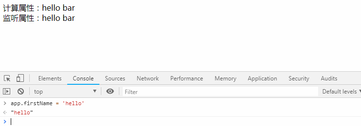

### 计算属性的 getter 和 setter

::: tip
计算属性默认只有`getter`，当然你也可以添加一个`setter`，它们分别会在读取计算属性和设置计算属性时被调用
:::

```html
<div id="app">计算属性的get和set：{{fullName}}<br /></div>
```

```js
var app = new Vue({
  el: "#app",
  data() {
    return {
      firstName: "foo",
      lastName: "bar"
    }
  },
  computed: {
    fullName: {
      get() {
        return this.firstName + " " + this.lastName
      },
      set(val) {
        let names = val.split(" ")
        this.firstName = names[0]
        this.lastName = names[names.length - 1]
      }
    }
  }
})
```

**运行结果：**

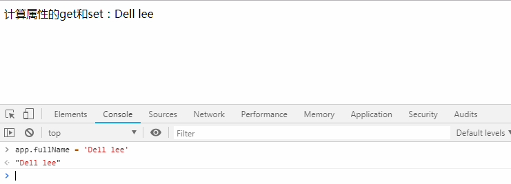

### Class 和 Style 绑定

::: tip
无论是`class`还是`style`的样式绑定，除了字符串类型，还可以是数组或者对象
:::

#### 绑定 Class

```css
.active {
  color: red
}
.star {
  background-color: #eee
}
.star-active {
  background-color: #58a
}
```

```html
<div id="app">
  <span @click="handleChangeStyle" :class="{active: isActive}"
    >对象形式绑定class</span
  ><br />
  <span @click="handleAddStyle" :class="[classArr]">对象形式绑定class</span>
</div>
```

```js
var app = new Vue({
  el: "#app",
  data() {
    return {
      isActive: false,
      classArr: ["star"]
    }
  },
  methods: {
    handleChangeStyle() {
      this.isActive = !this.isActive
    },
    handleAddStyle() {
      this.classArr.push("star-active")
    }
  }
})
```

**绑定 class 结果：**

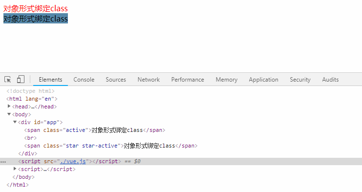

#### 绑定 style

```html
<div id="app">
  <span @click="handleChangeStyle" :style="styleObj">对象形式绑定style</span
  ><br />
  <span :style="[styleOne,styleTwo]">对象形式绑定style</span>
</div>
```

```js
var app = new Vue({
  el: "#app",
  data() {
    return {
      styleObj: {
        fontSize: "30px",
        color: "red",
        backgroundColor: "#58a"
      },
      styleOne: {
        color: "#f60",
        backgroundColor: "#333"
      },
      styleTwo: {
        fontSize: "20px"
      }
    }
  },
  methods: {
    handleChangeStyle() {
      this.isActive = !this.isActive
    }
  }
})
```

**绑定 style 结果：**

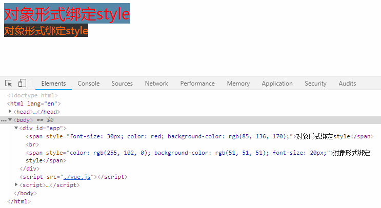

#### 处理厂商前缀

::: tip
在绑定`style`的语法中，如果`css`属性需要有不同兼容性浏览器的写法，`vue`提供了一种属性数组的方式来处理这种问题
:::

```html
<!-- 处理厂商前缀写法 -->
<div :style="{display: ['-webkit-box', '-ms-flexbox', 'flex']}"></div>
```

### 条件渲染

::: tip
`Vue`中的条件渲染主要有两种，一种是`v-if`，另外一种是`v-show`
:::

#### v-if、v-else-if 和 v-else

::: tip
`v-if`指令用于条件性的渲染一块内容。只有当指令的表达式为真值是才显示到页面上，并且`v-if`还可以和`v-else`、`v-else-if`混合一起使用
:::

```html
<div id="app">
  <!-- v-if单独使用 -->
  <p v-if="isShow">单独使用</p>
  <!-- v-if和v-else配合使用 -->
  <p v-if="isShow">显示</p>
  <p v-else>不显示</p>

  <!-- v-if、v-else-if、v-else使用 -->
  <p v-if="type=='A'">this is A</p>
  <p v-else-if="type=='B'">this is B</p>
  <p v-else>this is others</p>
</div>
```

```js
data() {
  return {
    isShow: true,
    type: 'A'
  }
}
```

**v-if 条件渲染结果：**


#### v-if 渲染分组

::: tip
如果多个元素标签要依赖同一个变量的值，控制是否在页面中显示，可以使用`template`进行渲染分组
:::

```html
<!-- 渲染分组 -->
<template v-if="isLogin">
  <p>用户名：{{username}}</p>
  <p>手机号：{{phone}}</p>
  <p>收获地址：{{address}}</p>
</template>
```

```js
data() {
  return {
    isLogin: false,
    username: 'aaa',
    phone: '13886867272',
    address: '广东广州'
  }
}
```

**渲染结果：**

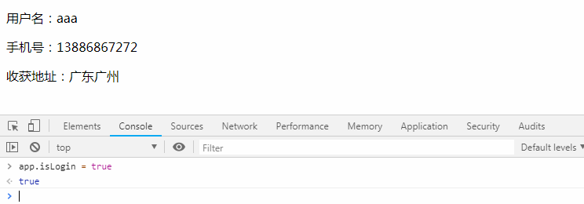

#### v-if 管理可复用的元素

::: tip
由于`Vue`会采用`diff`算法尽量可服用页面的`html`标签，所以如果有不需要出现这种情况，可以在元素标签上绑定不同的`key`值
:::

```html
<!-- 管理可复用元素 -->
<div v-if="type=='account'">用户名：<input type="text" /></div>
<div v-else>邮箱：<input type="text" /></div>
```

```js
data() {
  return {
    type: 'account'
  }
}
```

**管理可复用元素结果：**

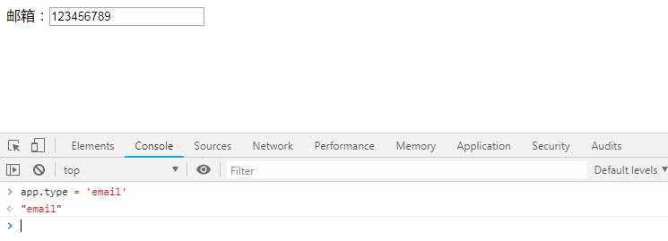

**添加 key 值：**

```html
<!-- 管理可复用元素 -->
<div v-if="type=='account'">用户名：<input type="text" key="username" /></div>
<div v-else>邮箱：<input type="text" key="email" /></div>
```

**添加 key 值后结果：**

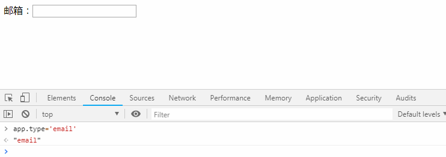

#### v-show

::: tip
`v-show`和`v-if`的作用是相同的，不过不同的是：`v-show`控制的元素始终会被渲染到页面上，只不过`v-show`是通过`display`属性来控制元素是否可见的
:::

```html
<p v-show="isShow">始终会出现在页面，通过display属性控制是否可见</p>
```

```js
data() {
  return {
    isShow: true
  }
}
```

#### v-if 和 v-show 比较

`v-if`和`v-show`比较，有如下特点：

- `v-if`是真正的渲染，它会保证其块内的事件或者子组件在适当的时候进行销毁和重建
- `v-if`存在一定的惰性，如果条件为假，则什么也不做，只有第一次渲染为真时，才会开始渲染条件块。
- `v-if`相比`v-show`有更大的开销，如果其绑定的条件频繁改变的话，它要在页面中不断的添加和移除元素标签，而相比较而言，`v-show`绑定的块，只是单纯的样式切换

### 列表渲染

::: tip
可以使用`item in items`语法或者`item of items`方式来进行列表的列表的渲染。在使用`v-for`进行列表渲染时，始终绑定`key`是一个提高性能的好方法。
:::

#### 列表渲染数组

::: tip

- `item`代表循环渲染时，数组中的每一项
- `key`代表循环渲染时，当前的索引值
  :::

```html
<!-- 数组渲染 -->
<div v-for="(item,index) in items" :key="item.id">
  {{item.text}} -- {{index}}
</div>
```

```js
data() {
  return {
    items: [
      {id: '0001', text: 'js'},
      {id: '0002', text: 'css'},
      {id: '0003', text: 'html'},
      {id: '0004', text: 'vue'}
    ]
  }
}
```

**列表渲染结果：**


#### 列表渲染对象

::: tip

- `item`代表循环渲染时，对象的值
- `key`代表循环渲染时，对象的键
- `index`代表循环渲染时，当前的索引值
  :::

```html
<!-- 对象渲染 -->
<div v-for="(item,key,index) in student" :key="index">
  {{item}} -- {{key}} -- {{index}}
</div>
```

```js
data() {
  return {
    student: {
      name: '张三',
      age: 23,
      sex: '男',
      address: '广东广州'
    }
  }
}
```

**对象列表渲染结果：**


### 数组、对象值更新检测

::: tip
`Vue` 包含一组观察数组的变异方法，当使用它们会触发视图更新。这些方法如下：

1. **shift**
2. **unshift**
3. **push**
4. **pop**
5. **splice**
6. **sort**
7. **reverse**
   :::
   **数组的更新检测：** 由于`Vue`是响应式的，所以你利用数组的下标去更改值或者更改数组的长度，是无法触发视图更新的

```js
var vm = new Vue({
  data: {
    items: ["a", "b", "c"]
  }
})
// 不是响应性的
vm.items[1] = "d"
vm.items.length = 2
```

**解决办法：** 第一个参数为要更改的数组，第二个参数为要更改项的索引，第三个参数为待更改的值

```js
// 这是响应性的
Vue.set(vm.items, 1, "d")
```

**对象的更新检测：** 相似的，只有在`data`中定义的对象属性，再做值的更改时，才会触发视图更新，新添加一个属性是不会触发视图更新的。

```js
var vm = new Vue({
  data: {
    student: {
      name: "张三",
      age: 23,
      sex: "男"
    }
  }
})
// 不是响应性的
vm.student.address = "广东广州"
```

**解决办法：** 第一个参数为要更改的对象，第二个参数为要添加的键，第三个参数待添加键的值

```js
// 这是响应性的
Vue.set(vm.student, "address", "广东广州")
```

### 修饰符

#### 事件修饰符

::: tip
在`JavaScript`的代码编写的过程中，使用`event.preventDefault()`和`event.stopPropagation()`两个方法是非常常见的需求，为此`Vue`内置了几种事件修饰符：

- `.stop`阻止冒泡
- `.prevent`阻止浏览器的默认行为、
- `.capture`事件捕获模式
- `.self`只有触发元素是自身时才执行的事件
- `.once`只执行一次的事件
- `.passive`事件行为立即触发，而不会等待
  :::

```html
<!-- 阻止冒泡 -->
<a @click.stop="doThis"></a>

<!-- 阻止浏览器的默认行为 -->
<form @submit.prevent="onSubmit"></form>

<!-- 修饰符可以串联 -->
<a @click.stop.prevent="doThis"></a>

<!-- 事件捕获模式 -->
<div @click.capture="doThis">...</div>

<!-- 只有触发元素是自身时才执行的事件 -->
<div @click.self="doThis">...</div>

<!-- 只执行一次的事件 -->
<div @click.once="doThis">...</div>

<!-- 事件行为立即触发，而不会等待 -->
<div @scroll.passive="onScroll">...</div>
```

#### 按键修饰符

::: tip
在监听键盘事件时，我们经常需要检查详细的按键。`Vue` 允许为`v-on`在监听键盘事件时添加按键修饰符，常见的按钮修饰符有：

- `.enter`回车键
- `.tab`tab 键
- `.delete`删除键或者退格键
- `.esc`
- `.space`空格键
- `.up`上方向键
- `.down`下方向键
- `.left`左方向键
- `.right`右方向键
- `.ctrl`
- `.alt`
- `.shift`
  :::

```html
<!-- 回车键 -->
<div @keyup.enter="doThis">...</div>

<!-- esc键 -->
<div @keyup.esc="doThis">...</div>

<!-- 左方向键 -->
<div @keyup.left="doThis">...</div>

<!-- ctrl键 -->
<div @keyup.ctrl="doThis">...</div>
```

**.exact 修饰符：**
::: tip
`.exact`修饰符允许你使用精确的按键组合来控制事件的触发
:::

```html
<!-- 有且只有ctrl按键被按下时触发 -->
<button @click.ctrl.exact="onCtrlClick">A</button>
```

## Vue 组件

### 使用组件的一些细节

#### is 解决标签正确嵌套的问题

::: tip
当在使用一些特定的标签中嵌套组件的时候，有时候可能报错，这个时候可以给组件添加`is`属性来解决
:::

```html
<table>
  <tbody>
    <row></row>
    <row></row>
    <row></row>
  </tbody>
</table>
```

```js
Vue.component("row", {
  template: "<tr> this is a row component!</tr>"
})
var app = new Vue({
  el: "#app"
})
```

**渲染结果：**

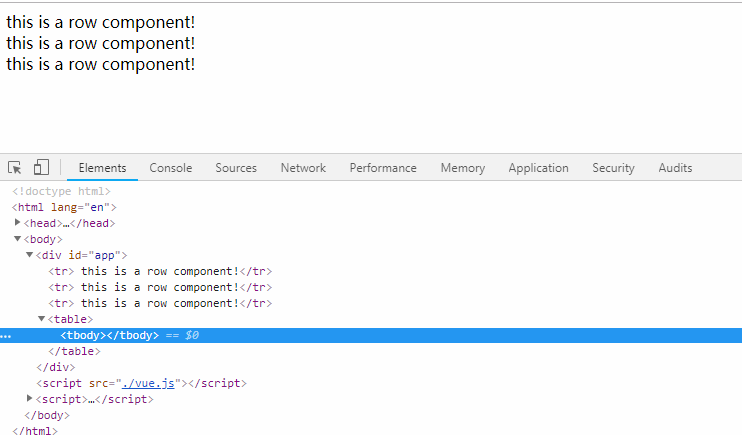

**使用 is 属性：**

```html
<table>
  <tbody>
    <tr is="row"></tr>
    <tr is="row"></tr>
    <tr is="row"></tr>
  </tbody>
</table>
```

**渲染结果：**


#### ref 引用

::: tip
在某些情况下，我们不得不选择操作 DOM，`Vue`提供了`ref`特性来让我们直接操作 DOM。`ref`再不同的情况下，有不同的返回结果：

- 在普通的标签上，它返回元素标签本身
- 在组件上，它返回组件的引用
  :::

```html
<div ref="hello" @click="handleHelloClick">hello,world</div>
<item ref="item" @item-change="handleItemChange"></item>
```

```js
Vue.component("item", {
  data() {
    return {
      message: "this is a  message!",
    }
  }
  methods: {
    handleItemClick() {
      this.$emit("item-change")
    }
  },
  template: '<div @click="handleItemClick">{{message}}</div>',
})
var app = new Vue({
  el: "#app",
  methods: {
    handleHelloClick() {
      console.log(this.$refs.hello.innerHTML)
    },
    handleItemChange() {
      console.log(this.$refs.item.message)
    }
  }
})
```

**引用结果：**


### 父子组件通信

::: tip 通信原则

- 父组件能向子组件传递任何类型的值，子组件通过`props`属性接受。
- 子组件不能修改父组件传递过来的值，子组件通过`this.$emit()`方法向父组件派发事件，并且这个事件可以携带参数。
  :::

```html
<counter :count="0" @change="handleChange"></counter>
<counter :count="0" @change="handleChange"></counter>
{{total}}
```

```js
Vue.component("counter", {
  template: '<div @click="handleCounterClick">{{number}}</div>',
  props: ["count"],
  data() {
    return {
      number: this.count
    }
  },
  methods: {
    handleCounterClick() {
      this.number++
      this.$emit("change", 1)
    }
  }
})
var app = new Vue({
  el: "#app",
  data() {
    return {
      total: 0
    }
  },
  methods: {
    handleChange(step) {
      this.total += step
    }
  }
})
```

**父子组件通信结果：**


### props 组件参数校验

::: tip
在父组件向子组件传递一些参数的时候，子组件有权对这些参数进行必要的校验，教研的内容包括：

- 参数的类型校验
- 参数是否必传
- `validator`自定义校验规则
  :::

```html
<item name="AAA" :age="23" phone="13886867272"></item>
```

```js
Vue.component("item", {
  template: "<div>姓名：{{name}}，年龄：{{age}}，手机号：{{phone}}</div>",
  props: {
    // 字符串类型且必传
    name: {
      type: String,
      required: true
    },
    // 字符串类型或者数字类型，默认值为0
    age: {
      type: String | Number,
      default: 0
    },
    // 长度必须是11位
    phone: {
      validator(value) {
        return value.length == 11
      }
    }
  }
})
```

**传参校验结果：**


#### Props 特性和非 Props 特性

::: tip 区别

- `props`特性传递的值不会出现在组件标签的属性上，并且在子组件中可以使用这个值
- 非`props`特性传递的值会出现在组件标签的属性上，并且不能在子组件中使用，会报错。
  :::

```html
<item name="AAA" :age="23" phone="13886867272"></item>
```

```js
Vue.component("item", {
  template: "<div>姓名：{{name}}，年龄：0，手机号：{{phone}}</div>",
  props: {
    // 字符串类型且必传
    name: {
      type: String,
      required: true
    },
    // 长度必须是11位
    phone: {
      validator(value) {
        return value.length == 11
      }
    }
  }
})
```

**Props 特性和非 Props 特性：**

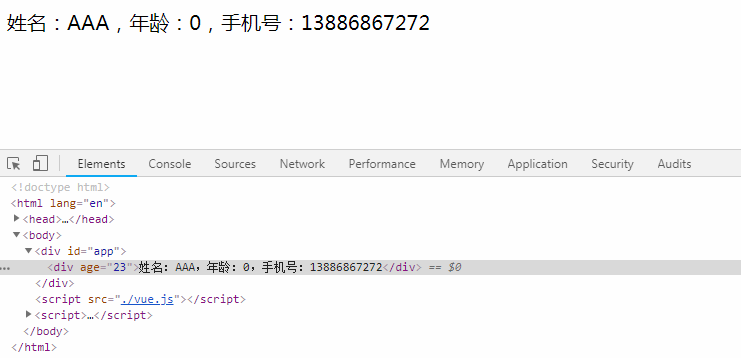

### 组件绑定原生事件

::: tip
如果要给一个组件绑定事件，可以使用`.native`修饰符，如果不写`.native`则表示监听的是自定义事件
:::

```html
<item @click.native="handleItemClick"></item>
```

```js
Vue.component("item", {
  template: "<div>hello,world</div>",
})
var app = new Vue({
  el: "#app",
  methods: {
    handleItemClick() {
      console.log("item native click")
    }
  }
})
```

**组件绑定原生事件结果：**

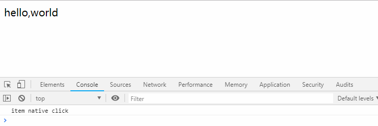

### 组件插槽

::: tip 理解
`Vue`中组件的`slot`插槽，简单理解就是：父组件可以向子组件传递一段`html`内容，子组件在合适的位置接受。在`Vue`中，关于插槽有三种情况：

- 普通的`slot`插槽
- 具名`slot`插槽
- 作用域插槽`slot-scope`
  :::

#### 普通插槽 slot

```html
<item>
  <p>这里是父组件给的html内容</p>
</item>
```

```js
Vue.component("item", {
  template: "<div><slot></slot></div>",
})
```

**普通插槽的结果：**


#### 具名插槽

::: tip
当父组件需要传递多模块的内容给子组件时，子组件需要写多个`slot`插槽，这个时候需要给每一个插槽起一个名字
:::

```html
<item>
  <div slot="header">header</div>
  <div slot="footer">footer</div>
</item>
```

```js
Vue.component("item", {
  template: `<div>
              <slot name="header"></slot>
              <div>content</div>
              <slot name="footer"></slot>
              <slot name="copyright"><div>default slot</div></slot>
            </div>`
})
```

**具名插槽的结果：**

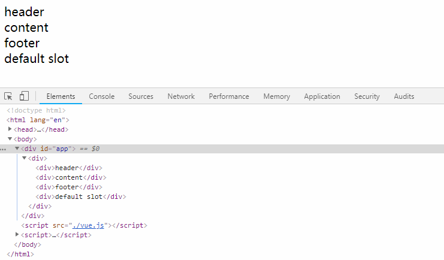

#### 作用域插槽

::: tip
作用域插槽能让插槽中的内容能够访问子组件中的数据
:::

```html
<item>
  <template slot-scope="props">
    <li>{{props.item}}-->hello,world</li>
  </template>
</item>
```

```js
Vue.component("item", {
  data() {
    return {
      list: [1, 2, 3, 4, 5],
    }
  },
  template: `<div>
              <ul>
                <slot v-for="item in list" :item="item"></slot>
              </ul>
            </div>`
})
```

**作用域插槽的结果：**


### 动态组件

::: tip
使用`component`组件，再配合此组件的`is`属性能够实现组件的动态切换
:::

```html
<component :is="type"></component> <button @click="handleChange">change</button>
```

```js
Vue.component("child-one", {
  template: "<div>child-one</div>"
})
Vue.component("child-two", {
  template: "<div>child-two</div>"
})
var app = new Vue({
  el: "#app",
  data() {
    return {
      type: "child-one"
    }
  },
  methods: {
    handleChange() {
      this.type = this.type == "child-one" ? "child-two" : "child-one"
    }
  }
})
```

**动态组件结果：**


#### v-once 指令配合动态组件

::: tip
在动态组件的切换过程中，会不断的销毁和重建子组件，如果组件的内容是相对固定的，可以在子组件上使用`v-once`指令来缓存。
:::

```js
Vue.component("child-one", {
  template: "<div v-once>child-one</div>"
})
Vue.component("child-two", {
  template: "<div v-once>child-two</div>"
})
```

#### keep-alive 保持动态组件的状态

::: tip
相同的道理，由于在动态组件的切换过程中，会不断的销毁和重建组件，如果你想保持一些组件的状态时，可以使用`keep-alive`组件来进行组件缓存
:::

```html
<keep-alive>
  <component :is="type"></component>
</keep-alive>
<button @click="handleChange">change</button>
```

## Vue 动画

### Vue 动画原理

Vue 在插入、移除 DOM 时，提供了多种应用过渡和动画的方式。

- 在 CSS 过渡和动画中自动应用`Class`
- 应用第三方动画库，例如: Animation.css
- 提供动画钩子函数，可以使用自己的`js`动画或者第三方`js`动画库

**先决条件：** 在应用动画时，决定动画是否能起作用，关键是要看标签是否有`v-show`或者`v-if`，以及是否被`transition`组件包裹

- `v-show`条件展示
- `v-if`条件渲染
- `transition`Vue 动画组件

**过渡的类名：** 在进入/离开的过渡中，Vue 过在合适的时机帮我们自动添加对应的`class`

- `v-enter`：定义进入过渡的开始状态。在元素被插入之前生效，在元素被插入之后的下一帧移除。
- `v-enter-active`：定义进入过渡生效时的状态。在整个进入过渡的阶段中应用，在元素被插入之前生效，在过渡/动画完成之后移除。这个类可以被用来定义进入过渡的过程时间，延迟和曲线函数。
- `v-enter-to`：定义进入过渡的结束状态。在元素被插入之后下一帧生效 (与此同时 v-enter 被移除)，在过渡/动画完成之后移除。
- `v-leave`：定义离开过渡的开始状态。在离开过渡被触发时立刻生效，下一帧被移除。
- `v-leave-active`：定义离开过渡生效时的状态
- `v-leave-to`：定义离开过渡的结束状态。在离开过渡被触发之后下一帧生效 (与此同时 v-leave 被删除)，在过渡/动画完成之后移除。


### Vue 中使用过渡/动画

#### Vue 中使用过渡

::: tip
在`Vue`中定义过渡，只要使用几个过渡类名即可

- `v-enter`和`v-leave-to`
- `v-enter-active`和`v-leave-active`
- PS：不给`transition`添加`name`，则默认过渡类名为`v`开头，添加`name`，则以命名的`name`开头，例如下列：`.fade-enter`
  :::

```css
.fade-enter,
.fade-leave-to {
  opacity: 0
}
.fade-enter-active,
.fade-leave-active {
  transition: opacity 0.3s
}
```

```html
<transition name="fade">
  <p v-show="isShow">Hello,world</p>
</transition>
<button @click="handleShowClick">切换</button>
```

```js
var vm = new Vue({
  el: "#app",
  data() {
    return {
      isShow: true
    }
  },
  methods: {
    handleShowClick() {
      this.isShow = !this.isShow
    }
  }
})
```

过渡 gif 录制中...

#### Vue 中使用动画

::: tip
Vue 中动画的用法同 Vue 过渡，区别在于`v-enter`这个类名不会在 DOM 节点插入后立即删除，而是在`animationend`事件触发后删除。
:::

```css
.bounce-enter-active {
  transform-origin: left center
  animation: bounce-in 0.5s
}
.bounce-leave-active {
  transform-origin: left center
  animation: bounce-in 0.5s reverse
}
@keyframes bounce-in {
  0% {
    transform: scale(0)
  }
  50% {
    transform: scale(1.5)
  }
  100% {
    transform: scale(1)
  }
}
```

```html
<transition name="bounce">
  <p v-if="isShow">Hello, world</p>
</transition>
<button @click="isShow=!isShow">切换</button>
```

```js
var vm = new Vue({
  el: "#app",
  data() {
    return {
      isShow: true
    }
  }
})
```

动画 gif 录制中...

#### 动画和过渡一起使用

::: tip
如果要同时使用过渡和动画，由于动画和过渡持续的时间可能并不是一样的，所以需要给`transition`组件指定一个`type`，其属性值有：`transition`和`animation`。还可以对动画时间进行控制。
:::
**控制动画持续时间：**

```html
<transition
  type="animation"
  name="fade"
  :duration="1000"
  enter-active-class="bounce-enter-active"
  leave-active-class="bounce-leave-active"
></transition>
```

**分别控制进入和离开动画时间：**

```html
<transition
  type="animation"
  name="fade"
  :duration="{enter: 500, leave: 800}"
  enter-active-class="bounce-enter-active"
  leave-active-class="bounce-leave-active"
></transition>
```

```css
.fade-enter,
.fade-leave-to {
  opacity: 0
}
.fade-enter-active,
.fade-leave-active {
  transition: opacity 0.3s
}

.bounce-enter-active {
  transform-origin: left center
  animation: bounce-in 0.5s
}
.bounce-leave-active {
  transform-origin: left center
  animation: bounce-in 0.5s reverse
}
@keyframes bounce-in {
  0% {
    transform: scale(0)
  }
  50% {
    transform: scale(1.5)
  }
  100% {
    transform: scale(1)
  }
}
```

```html
<transition
  type="animation"
  name="fade"
  enter-active-class="bounce-enter-active"
  leave-active-class="bounce-leave-active"
>
  <p v-if="isShow">Hello, world</p>
</transition>
<button @click="isShow=!isShow">切换</button>
```

```js
var vm = new Vue({
  el: "#app",
  data() {
    return {
      isShow: true
    }
  }
})
```

动画 gif 录制中

### 使用第三方动画库

::: tip
第三方动画库，例如`Animation.css`，用法同 Vue 中动画的用法类似，只不过把`animation`动画的名字改成第三方动画库的名字。(引入`Animation.css`文件)
:::

```css
.animation-enter-active {
  animation: flash 0.5s
}
.animation-leave-active {
  animation: shake 0.5s reverse
}
```

````html
<transition name="animation">
  <p v-if="isShow">Hello, world</p>
</transition>
<button @click="isShow=!isShow">切换</button>
```js var vm = new Vue({ el: '#app', data() { return { isShow: true } } })
````

动画 gif 录制中

### Vue 初始过渡

::: tip
无论是过渡还是动画，都依赖于元素标签的移除、插入和显示，意味着初始化时不会有动画效果，可以使用`appear`来实现初始化时有过渡和动画的效果。
:::

```css
.flash-enter-active {
  animation: flash 0.5s
}
.bounce-leave-active {
  animation: shake 0.5s
}
```

```html
<transition
  appear
  enter-active-class="flash-enter-active"
  leave-active-class="bounce-leave-active"
  appear-active-class="flash-enter-active"
>
  <p v-if="isShow">Hello, world</p>
</transition>
<button @click="isShow=!isShow">切换</button>
```

```js
var vm = new Vue({
  el: "#app",
  data() {
    return {
      isShow: true
    }
  }
})
```

动画 gif 录制中

### Vue 中使用 JS 动画库

::: tip
在一个动画的执行周期中，Vue 提供了不同的钩子函数来让我们可以自定义自己的`js`动画，当然也可以使用第三方`js`动画。在纯粹使用`js`动画时，可以使用`:css="false"`来避免 Vue 的 CSS 监测。
:::
::: tip
在钩子函数`enter(el,done)`和`leave(el,done)`中的`done`方法必须进行回调，否则将被同步执行，过渡会立即完成。
:::

```html
<transition
  @before-enter="handelBeforeEnter"
  @enter="handleEnter"
  @after-enter="handleAfterEnter"
  @before-leave="handleBeforeLeave"
  @leave="handleLeave"
  @after-leave="handleAfterLeave"
>
  <p v-if="isShow">Hello, world</p>
</transition>
<button @click="isShow=!isShow">切换</button>
```

```js
var vm = new Vue({
  el: "#app",
  data() {
    return {
      isShow: true
    }
  },
  methods: {
    handelBeforeEnter(el) {
      el.style.color = "red"
      console.log("before enter")
    },
    handleEnter(el, done) {
      setTimeout(() => {
        el.style.color = "green"
        done()
        console.log("enter")
      }, 1500)
    },
    handleAfterEnter(el) {
      console.log("after enter")
    },

    handleBeforeLeave(el) {
      el.style.color = "yellow"
      console.log("before leave")
    },
    handleLeave(el, done) {
      setTimeout(() => {
        el.style.color = "blue"
        done()
        console.log("leave")
      }, 1000)
    },
    handleAfterLeave(el) {
      console.log("after leave")
    }
  }
})
```

动画 gif 录制中...

### 多个元素/组件过渡

::: tip
同动态组件`component`，在切换相同的 DOM 元素时，Vue 会复用 DOM 元素，如果这不是我们想要的结果，可以像`component`一样，始终给元素标签设置一个 key 是一个好的选择
:::

```css
.v-enter,
.v-leave-to {
  opacity: 0
}
.v-enter-active,
.v-leave-active {
  transition: opacity 0.5s
}
```

```html
<transition>
  <p v-if="isShow" key="A">this is A</p>
  <p v-else key="others">this is others</p>
</transition>
<button @click="isShow=!isShow">切换</button>
```

```js
var vm = new Vue({
  el: "#app",
  data() {
    return {
      isShow: true
    }
  }
})
```

动画 gif 录制中

### Vue 中列表过渡

::: tip
前面讲到的过渡/动画，全部是一个元素的过渡/动画，或者多个元素中的一个进行过渡/动画，可以使用`transition-group`组件来结合`v-for`进行列表的过渡/动画
:::

```css
.item {
  display: inline-block
  margin-right: 10px
}
.v-enter,
.v-leave-to {
  opacity: 0
  transform: translateY(30px)
}
.v-enter-active,
.v-leave-active {
  transition: all 0.5s
}
```

```html
<transition-group>
  <div v-for="(item,index) in list" :key="item" class="item">{{item}}</div>
</transition-group>
<button @click="handleAddClick">添加</button>
```

```js
var vm = new Vue({
  el: "#app",
  data() {
    return {
      isShow: true,
      list: [1, 2, 3, 4, 5]
    }
  },
  methods: {
    handleAddClick() {
      let maxItem = this.list[this.list.length - 1]
      this.list.push(maxItem + 1)
    }
  }
})
```

动画 gif 录制中

## Vue-Router(路由)

::: tip
Vue Router 是 Vue.js 官方的路由管理器。它和 Vue.js 的核心深度集成，让构建单页面应用变得易如反掌
:::

### 安装

::: tip
Vue Router 它依赖于 Vue.js，主要安装方式有两种，一种是通过 Script 标签引入，另一种是通过 npm 引入。
:::

#### 通过 Script 引入

```html
<script src="https://unpkg.com/vue/dist/vue.js"></script>
<script src="https://unpkg.com/vue-router/dist/vue-router.js"></script>
```

#### 通过模块化引入

```js
// 安装npm包
$ npm install vue-router

// 模块化引入
import Vue from 'vue'
import VueRouter from 'vue-router'
Vue.use(VueRouter)
```

### 动态路由

::: tip
我们有时间需要把一组固定的 URL 路由到同一个组件，例如我们有`User`组件，对于不同 ID 的用户，都要使用这个组件来渲染。可以通过`/user/:id`的形式，来匹配路由，其 id 参数可以通过`this.$route.params.id`来获取，这种就叫做动态路由。
:::

```js
var User = {
  template: "<div>{{$route.params.id}}<div>",
}
var router = new VueRouter({
  routes: [{ path: "/user/:id", component: User }]
})
```

我们也可以使用多段动态路由匹配规则，参数同样保存在`this.$route.params`中：

```js
var User = {
  template: "<div>{{$route.params.username}} - {{$route.params.postId}}<div>"
}
var router = new VueRouter({
  routes: [{ path: "/user/:username/post/:postId", component: User }]
})
```

### 嵌套路由

::: tip
实际应用中，项目往往是由多层嵌套的组件组合而成，可以利用 Vue Router 来轻松实现这一点。
:::
::: warning
在子组件中不要已`/`开头，如果带上`/`，它会被认为是根路径下的路由。
:::
**创建根节点：**

```html
<div id="app">
  <router-link to="/user/123">用户信息</router-link>
  <router-view></router-view>
</div>
```

**创建路由以及子组件：**
::: tip
子路由通过在父路由中写`children`属性，它是一个数组，用法同普通的路由一致。
:::

```js
var User = {
  template: `
    <div class="user">
      <h2>参数：{{$route.params.id}}</h2>
      <router-link to="/user/123/order">订单信息</router-link>
      <router-link to="/user/123/address">地址信息</router-link>
      <router-link to="/user/123/avatar">头像信息</router-link>
      <router-view></router-view>
    </div>`
}
var UserOrder = {
  template: "<div>这里是用户订单信息页面</div>"
}
var UserAddress = {
  template: "<div>这里是用户地址信息页面</div>"
}
var UserAvatar = {
  template: "<div>这里是用户头像信息页面</div>"
}
var router = new VueRouter({
  routes: [
    {
      path: "/user/:id",
      component: User,
      children: [
        // 不要带/
        { path: "order", component: UserOrder },
        { path: "address", component: UserAddress },
        { path: "avatar", component: UserAvatar }
      ]
    }
  ]
})

var vue = new Vue({
  router,
}).$mount("#app")
```


### 编程式导航

::: tip router.push()
除了使用`<router-link to="xxx">`这种创建 a 标签来导航链接的**声明式**导航，我们还可以使用代码来进行**编程式**导航。
:::
::: warning
提供了`path`，`params`会被忽略。
:::

```js
// 字符串
this.$router.push("home")

// 对象
this.$router.push({ path: "home" })

// 命名的路由
this.$router.push({ name: "user", params: { userId: "123" } })

// 带查询参数，变成 /register?plan=private
this.$router.push({ path: "register", query: { plan: "private" } })
```

**注意：** 如果当前路由和待导航的路由是一致的，只是参数不同，这种情况下，需要使用`beforeRouteUpdate`来获取参数的变化。

::: tip router.replace()
`router.replace()` 与`router.push()`方法很相似，区别在于`router-replace()`不会像`history`中添加新纪录，而是替换掉当前的记录。

- `<router-link to="xxx" replace>`
- `router.replace('xxx')`
  :::

```js
// 如果路由是/user，要替换到/order
this.$router.replace("order")
```

::: tip router.go()
`router.go()`的表现行为同`history`的表现形式是一致的
:::

```js
// 前进一步 == history.forward()
router.go(1)

// 后退一步 == history.back()
router.go(-1)

// 前进三步
router.go(3)
```

### 命名路由和命令视图

#### 命名路由

::: tip
有时候通过名称来标记一个路由会显得非常方便，特别是在一个连接，执行某一些跳转的时候。可以通过设置路由的名字来实现一点，参考如下
:::

```js
const router = new VueRouter({
  routes: [
    {
      path: "/user/:userId",
      name: "user",
      component: User
    }
  ]
})
```

**在声明式导航中使用命名路由：** `<router-link to="xxx">` 其中`to`可以接受一个对象

```html
<router-link to="{ name:'user', params:{ id: 123 }}"></router-link>
```

**在编程式导航中使用命名路由：**

```js
this.$router.push({ name: "user", params: { id: 123 } })
```

#### 命名视图

有时候想同级展示多个视图，而不是嵌套视图，例如：`sidebar`和`main`，这个时候命名视图就派上了用场，如果写`name`属性，则默认是`default`。

```html
<router-view></router-view>
<router-view name="address"></router-view>
<router-view name="avatar"></router-view>
```

```js
var UserOrder = {
  template: "<div>这里是用户订单信息页面</div>"
}
var UserAddress = {
  template: "<div>这里是用户地址信息页面</div>"
}
var UserAvatar = {
  template: "<div>这里是用户头像信息页面</div>"
}
var router = new VueRouter({
  routes: [
    {
      path: "/",
      components: {
        default: UserOrder,
        address: UserAddress,
        avatar: UserAvatar
      }
    }
  ]
})
var vue = new Vue({
  router
}).$mount("#app")
```

### 导航守卫

::: tip
顾名思义，导航既意味着路由正在发生变化，Vue Router 提供的导航守卫功能主要用来通过跳转或者取消的方式守卫导航，导航守卫有多种情况：

- 全局导航守卫
- 单个路由独享的导航守卫
- 组件级导航守卫
  :::

#### 全局导航守卫

::: tip
可以使用`router.beforeEach()`来注册一个全局的前置守卫，可以使用`router.afterEach()`来注册全局的后置守卫
:::

```js
const router = new VueRouter({ ... })

// 前置守卫
router.beforeEach((to, from, next) => {
  // todo
})
// 后置守卫
router.afterEach((to, from) => {
  // todo
})
```

**参数解析：**

- `to`：即将要进入的目标
- `from`：即将要离开的目标
- `next`：在前置守卫中，一定要调用该方法来`resolve`前置守卫这个钩子，前值守卫的执行效果依赖于它所传递的参数。<br/>

**next 参数解析：**

1. `next()`执行管道中的下一个钩子。
2. `next(false)`中断导航
3. `next('xxx')`跳转到一个不同的地址
4. `next(new Error())`导航被终止

#### 路由独享的守卫

::: tip
可以在某一个路由下直接定义`beforeEnter()`方法，它的参数和用法同全局导航守卫一样。
:::

```js
const router = new VueRouter({
  routes: [
    {
      path: "/foo",
      component: Foo,
      beforeEnter: (to, from, next) => {
        // todo
      }
    }
  ]
})
```

#### 组件内的守卫

::: tip
我们可以在任意组件中使用如下几个函数：

- `beforeRouteEnter(to, from, next)`：渲染此组件对应的路由`confirm`之前被调用
- `beforeRouteUpdate(to, from, next)`: 当路由被改变，但组件被复用时触发，例如`/user/1` 导航到 `/user/2`
- `beforeRouteLeave(to, from, next)`：导航离开该组件对应的路由时触发
  :::

```js
var User = {
  template: "<div>User</div>",
  beforeRouteEnter(to, from, next) {
    // 渲染此组件对应的路由`confirm`之前被调用，无法直接使用this
  },
  beforeRouteUpdate(to, from, next) {
    // 路由发生改变，但组件被复用时触发，可以使用this
  },
  beforeRouteLeave(to, from, next) {
    // 导航离开该组件对应的路由时触发，可以使用this
  }
}
```

#### 完整的导航解析过程

- 导航被触发。
- 在失活的组件里调用离开守卫。
- 调用全局的 beforeEach 守卫。
- 在重用的组件里调用 beforeRouteUpdate 守卫 (2.2+)。
- 在路由配置里调用 beforeEnter。
- 解析异步路由组件。
- 在被激活的组件里调用 beforeRouteEnter。
- 调用全局的 beforeResolve 守卫 (2.5+)。
- 导航被确认。
- 调用全局的 afterEach 钩子。
- 触发 DOM 更新。
- 用创建好的实例调用 beforeRouteEnter 守卫中传给 next 的回调函数。

### 滚动行为

::: tip
当我们切换路由的时候，想要滚动到页面的顶部或者保持原有的滚动位置，就像重新加载页面那样。Vue Router 可以轻松帮我们实现这个效果。但这个功能只在支持**`history.pushState`**的浏览器中使用。
:::

#### 滚动到页面顶部

```js
const router = new VueRouter({
  routes: [...],
  scrollBehavior (to, from, savedPosition) {
    // 滚动到页面顶部
    return {
      x: 0,
      y: 0
    }
  }
})
```

#### 滚动到前进后退页面原始的位置

```js
const router = new VueRouter({
  routes: [...],
  scrollBehavior (to, from, savedPosition) {
    // 滚动到前进后退页面原始的位置
    if(savedPosition) {
      return savedPosition
    } else {
      return { x:0, y: 0 }
    }
  }
})
```

#### 滚动到锚点位置

```js
const router = new VueRouter({
  routes: [...],
  scrollBehavior (to, from, savedPosition) {
    // 滚动到锚点位置
    if(to.hash) {
      return {
        selector: to.hash
      }
    }
  }
})
```

### 路由懒加载

::: tip
随着项目的体积增大，打包后的包也越来越大，我们希望只有当我们访问某一个路由时，其对应的组件才被加载，这样就更好。要实现这一想法，需要集合 Vue 的异步组件和 webpack 代码分隔的功能。
:::
**一个路由懒加载可以如下：**

```js
var router = new VueRouter({
  routes: [
    { path: "/order", component: () => import("@/components/order.vue") },
    { path: "/address", component: () => import("@/components/address.vue") },
    { path: "/avatar", component: () => import("@/components/avatar.vue") }
  ]
})
```

## Vuex(状态管理)

### 安装

::: tip
使用到 Vuex 的地方，一般是大型单页项目，这个时候可通过`npm install`方式进行安装
:::

```js
$ npm install vuex --save
```

**使用 Vuex：** 在使用`vue-cli`脚手架初始化项目的情况下，需要在`main.js`中通过以下方式来使用`Vuex`

```js
import Vue from "vue"
import Vuex from "vuex"
Vue.use(Vuex)
```

### Vuex 概念

::: tip
Vuex 是一个专为 Vue.js 应用程序开发的**状态管理模式**。它采用**集中式存储**管理应用的所有组件的状态，并以相应的规则保证状态以一种可预测的方式发生变化。
:::


**什么情况下使用 Vuex：** 由于 Vuex 的设计思想：采用集中式存储管理应用的所有组件的状态，所以 Vuex 更适合在中大型项目中大展拳脚，如何只是构建一个小型应用的话，引入 Vuex 则带来了更多了框架概念，这对于小型应用而言可能并不是一个好的选择。

### State

::: tip
store 的概念是一个仓库或者容器，它包含了应用中大部分状态（State），与全局对象不同的是：

- Vuex 的状态存储是响应式的
- 不能通过直接修改 state 的方式来更新，而是需要需要显示的提交(commit)
  :::

#### 一个简单的 Store 案例

**创建 store 文件夹：** 在`src`目录下新建`store`文件夹

```
$ mkdir store
```

**创建 index.js：** 在`store`文件夹下新建`index.js`

```
$ cd store
$ touch index.js
```

```js
import Vue from "vue"
import Vuex from "vuex"
Vue.use(Vuex)

const state = {
  count: 1,
  price: 10
}
export default new Vuex.Store({
  state
})
```

**引用 store.js：** 在`main.js`中引入`store.js`，使得`vuex`注入每一个组件中

```js
import store from "@/store/index.js"

new Vue({
  el: "#app",
  store,
  components: { App },
  template: "<App/>"
})
```

**在页面中使用 state：**
::: tip
我们通过 Vuex 提供的`mapState`辅助方法，来简化我们的代码，这样我们就不用使用`this.$store.state.count`和`this.$store.state.price`方式来获取`state`变量了。`...`是 ES6 新的扩展运算符，使用它可以把`mapState`中的`state`扩展到组件的计算属性上面去。
:::

```html
<div class="hello">{{count}} - {{price}}</div>
```

```js
import { mapState } from "vuex"
export default {
  name: "HelloWorld",
  data() {
    return {}
  },
  computed: {
    ...mapState(["count", "price"])
  }
}
```

### Getters

::: tip
Getter 允许我们依赖于已有的`state`而派生出一些状态来，例如：过滤已完成的 todos。Getter 有点类似于 Vue 中的计算属性，只有它依赖的值改变时，它才会重新计算。
:::
**store/index.js 代码：**

```js
const state = {
  count: 1,
  price: 10,
  todos: [
    { id: 1, name: "学习JavaScript", done: true },
    { id: 2, name: "学习HTML", done: false },
    { id: 3, name: "学习CSS", done: false },
    { id: 4, name: "学习Vue", done: true },
    { id: 5, name: "学习Node", done: false }
  ]
}
const getters = {
  todoDone(state) {
    return state.todos.filter((item) => item.done)
  }
}
export default new Vuex.Store({
  state,
  getters
})
```

**组件代码：**

```html
<div class="hello">
  {{count}} - {{price}}
  <div v-for="todo in todoDone" :key="todo.id">{{todo.name}}</div>
</div>
```

```js
import { mapState, mapGetters } from "vuex"
export default {
  name: "HelloWorld",
  data() {
    return {}
  },
  computed: {
    ...mapState(["count", "price"]),
    ...mapGetters(["todoDone"])
  }
}
```


### Mutations

::: tip
如要要修改 Vuex 中的 State，必须通过提交`mutation`的方式来进行更改，同时`mutation`还有如下特点：

- `mutation`是同步事务
- 可以传递参数
- 可以用过`mapMutations`映射到组件的`methods`方法中
  :::

**store/index.js 代码：**

```js
import Vue from "vue"
import Vuex from "vuex"
Vue.use(Vuex)

const state = {
  count: 1,
  price: 10,
  todos: [
    { id: 1, name: "学习JavaScript", done: true },
    { id: 2, name: "学习HTML", done: false },
    { id: 3, name: "学习CSS", done: false },
    { id: 4, name: "学习Vue", done: true },
    { id: 5, name: "学习Node", done: false }
  ]
}
const getters = {
  todoDone(state) {
    return state.todos.filter((item) => item.done)
  }
}
const mutations = {
  add(state, number) {
    state.count += number
  },
  reduce(state) {
    state.count--
  }
}
export default new Vuex.Store({
  state,
  getters,
  mutations
})
```

**组件代码：**

```html
<div class="hello">
  {{count}} - {{price}}
  <button @click="handleAddClick(2)">增加</button>
  <button @click="handleReduceClick">减少</button>
  <div v-for="todo in todoDone" :key="todo.id">{{todo.name}}</div>
</div>
```

```js
import { mapState, mapGetters, mapMutations } from "vuex"
export default {
  name: "HelloWorld",
  data() {
    return {}
  },
  computed: {
    ...mapState(["count", "price"]),
    ...mapGetters(["todoDone"])
  },
  methods: {
    ...mapMutations({
      handleAddClick: "add",
      handleReduceClick: "reduce"
    })
  }
}
```


### Actions

::: tip
`action`同`mutations`功能类似，但它们还是有区别的：

- `action`提交的是`mutation`，而不是直接更改状态
- `action`里面可以写异步代码
  :::
  **store/index.js 代码：**

```js
const state = {
  count: 1,
  price: 10,
  reduceResult: false,
  todos: [
    { id: 1, name: "学习JavaScript", done: true },
    { id: 2, name: "学习HTML", done: false },
    { id: 3, name: "学习CSS", done: false },
    { id: 4, name: "学习Vue", done: true },
    { id: 5, name: "学习Node", done: false }
  ]
}
const getters = {
  todoDone(state) {
    return state.todos.filter((item) => item.done)
  }
}
const mutations = {
  add(state, number) {
    state.count += number
  },
  reduce(state) {
    state.count--
  },
  reduceResult(state, flag) {
    state.reduceResult = flag
  }
}
const actions = {
  asyncAdd({ commit }, number) {
    setTimeout(() => {
      commit("add", number)
    }, 0)
  },
  asyncReduce({ commit }) {
    return new Promise((resolve, reject) => {
      commit("reduce")
      resolve(true)
    })
  },
  reduceResult({ commit }, flag) {
    commit("reduceResult", flag)
  }
}
export default new Vuex.Store({
  state,
  getters,
  mutations,
  actions
})
```

**组件代码：**

```html
<div class="hello">
  {{count}} - {{price}}<br />
  异步删减结果：{{reduceResult}}
  <button @click="handleAsyncAdd(2)">增加</button>
  <button @click="handleAsyncReduce">减少</button>
  <div v-for="todo in todoDone" :key="todo.id">{{todo.name}}</div>
</div>
```

```js
import { mapState, mapGetters, mapMutations, mapActions } from "vuex"
export default {
  name: "HelloWorld",
  data() {
    return {}
  },
  computed: {
    ...mapState(["count", "price", "reduceResult"]),
    ...mapGetters(["todoDone"])
  },
  methods: {
    handleAsyncReduce() {
      this.asyncReduce().then((flag) => {
        this.asyncReduceResult(flag)
      })
    },
    ...mapMutations({
      handleAddClick: "add",
      handleReduceClick: "reduce"
    }),
    ...mapActions({
      handleAsyncAdd: "asyncAdd",
      asyncReduce: "asyncReduce",
      asyncReduceResult: "reduceResult"
    })
  }
}
```


### Modules

::: tip
由于使用单一状态树，应用的所有状态会集中到一个比较大的对象。当应用变得非常复杂时，store 对象就有可能变得相当臃肿。<br/>为了解决以上问题，Vuex 允许我们将 store 分割成模块（module）。每个模块拥有自己的 state、mutation、action、getter。
:::
一个包含`modules`的 Vuex 可能如下所示：

```js
const moduleA = {
  state: { ... },
  mutations: { ... },
  actions: { ... },
  getters: { ... }
}

const moduleB = {
  state: { ... },
  mutations: { ... },
  actions: { ... }
}

const store = new Vuex.Store({
  modules: {
    a: moduleA,
    b: moduleB
  }
})

store.state.a // -> moduleA 的状态
store.state.b // -> moduleB 的状态
```

**添加 store/A.js：**

```js
const state = {
  counter: 11,
  price: 111
}
const mutations = {
  add(state) {
    state.counter++
  },
  reduce(state) {
    state.counter -= 10
  }
}
const actions = {
  add({ commit }) {
    commit("add")
  },
  reduce({ commit }) {
    commit("reduce")
  }
}
// 开启命名空间能够让模块具有更高的封装度和复用性
export default {
  namespaced: true,
  state,
  mutations,
  actions
}
```

**添加 store/B.js：**

```js
const state = {
  counter: 22,
  price: 222
}
const mutations = {
  add(state) {
    state.counter++
  },
  reduce(state) {
    state.counter -= 10
  }
}
const actions = {
  add({ commit }) {
    commit("add")
  },
  reduce({ commit }) {
    commit("reduce")
  }
}
// 开启命名空间能够让模块具有更高的封装度和复用性
export default {
  namespaced: true,
  state,
  mutations,
  actions
}
```

**index.js 代码：**

```js
import Vue from "vue"
import Vuex from "vuex"
import A from "./a"
import B from "./b"
Vue.use(Vuex)

export default new Vuex.Store({
  modules: {
    A,
    B
  }
})
```

**组件代码：**

```html
<div>
  <p>A模块的内容</p>
  数量：<span>{{ACounter}}</span> 价格：<span>{{APrice}}</span>
  <button @click="handleAModuleAdd">增加</button>
  <button @click="handleAModuleReduce">减少</button>
</div>
<div>
  <p>B模块的内容</p>
  数量：<span>{{BCounter}}</span> 价格：<span>{{BPrice}}</span>
  <button @click="handleBModuleAdd">增加</button>
  <button @click="handleBModuleReduce">减少</button>
</div>
```

```js
import { mapState, mapActions } from "vuex"
export default {
  name: "HelloWorld",
  data() {
    return {}
  },
  computed: {
    // 第一个参数代表模块的名字
    ...mapState("A", {
      ACounter: "counter",
      APrice: "price"
    }),
    ...mapState("B", {
      BCounter: "counter",
      BPrice: "price"
    })
  },
  methods: {
    // 第一个参数代表模块的名字
    ...mapActions("A", {
      handleAModuleAdd: "add",
      handleAModuleReduce: "reduce"
    }),
    ...mapActions("B", {
      handleBModuleAdd: "add",
      handleBModuleReduce: "reduce"
    })
  }
}
```


### 推荐目录结构

```
├── index.html
├── main.js
├── api
│   └── ... # 抽取出API请求
├── components
│   ├── App.vue
│   └── ... # 其他组件
└── store
    ├── index.js          # 我们组装模块并导出 store 的地方
    ├── actions.js        # 根级别的 action
    ├── mutations.js      # 根级别的 mutation
    └── modules
        ├── XXX.js       # XXX模块
        └── XXX.js       # XXX模块
```

## Vue 原理

### Vue 原理剖析

关于 Vue 相关原理剖析，请跳转至[Vue 原理剖析](/vue/vueAnalysis.md)阅读更多。
